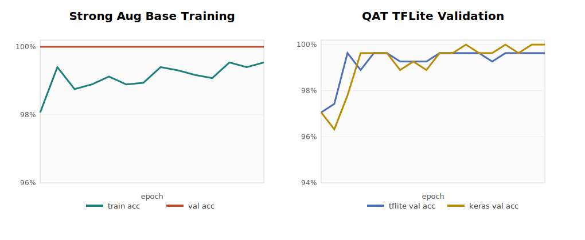
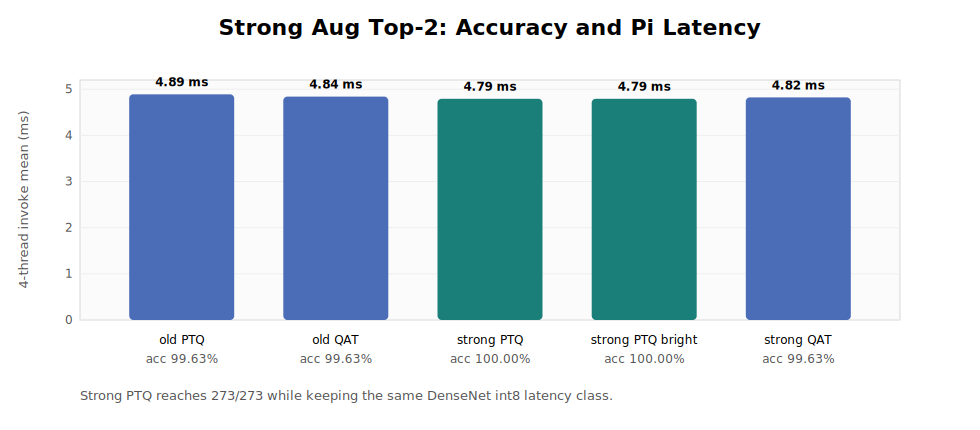
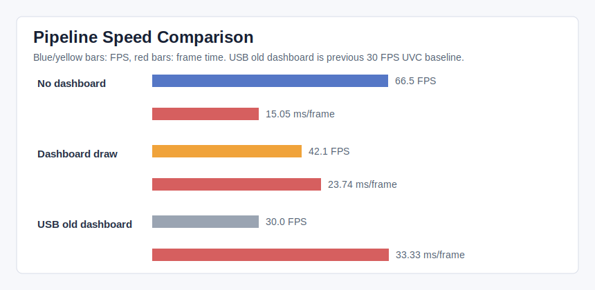
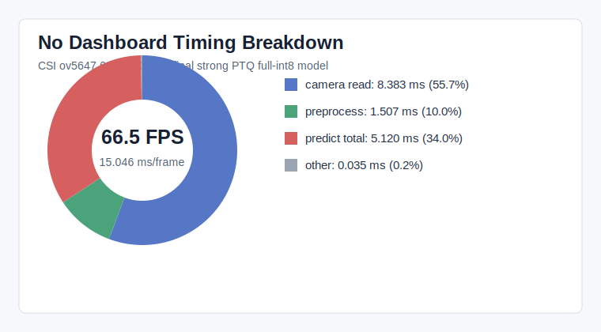
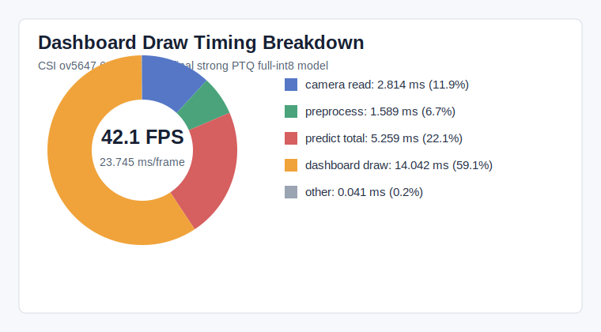
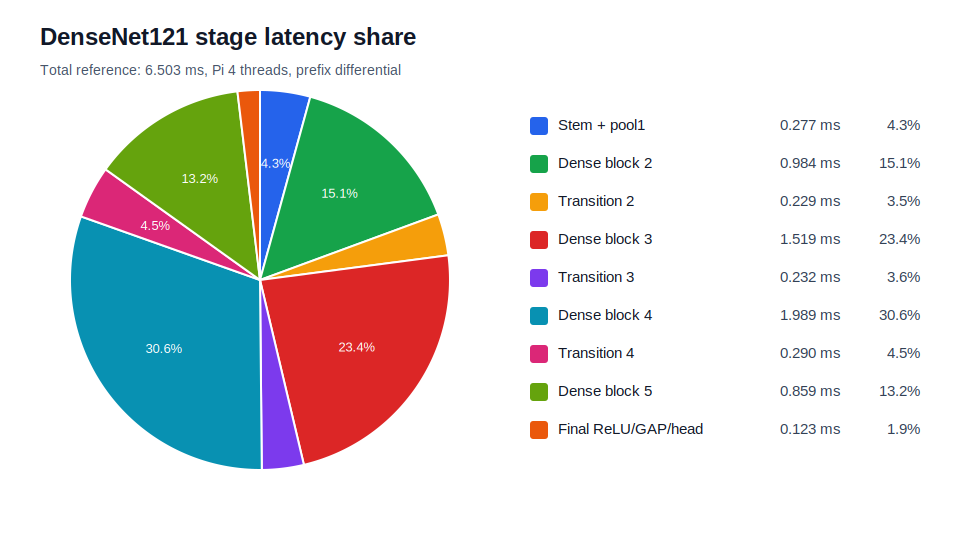
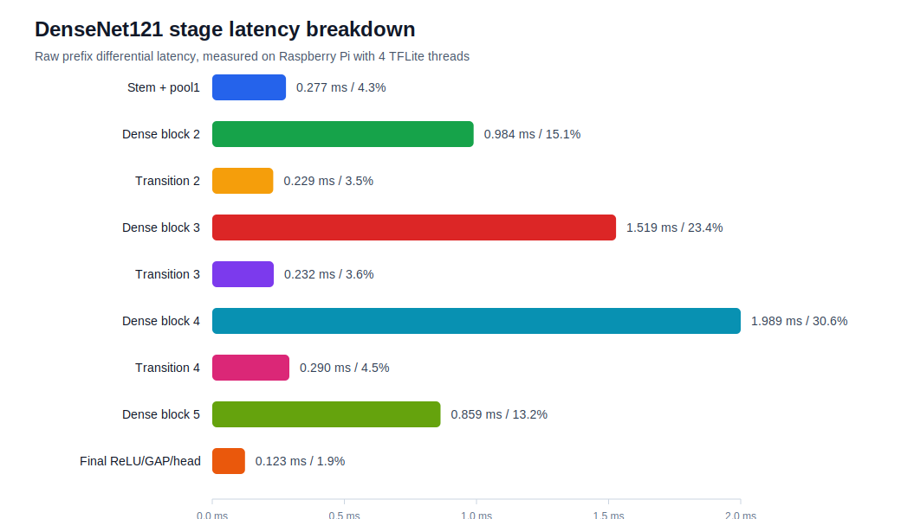

# 유정현 최종과제

## 프로젝트 제목

Raspberry Pi 실시간 가위바위보 인식 시스템

## 제출자

- 이름: 유정현
- 학번: 2025324048
- 과목: 2026-1 AI혁신반도체

## 1. 프로젝트 개요

본 프로젝트에서는 가위바위보(RPS) 3-class 이미지 데이터셋을 대상으로 DenseNet121 기반 transfer learning을 수행하고, 학습된 모델을 TFLite full-int8 모델로 변환한 뒤 Raspberry Pi 실시간 카메라 파이프라인에 배치하였다.

실험 범위는 baseline 학습, data augmentation, PTQ/QAT 양자화, pruning/sparsity 실험, Raspberry Pi camera-preprocess-inference-display end-to-end latency 분석을 포함한다.

최종 목표는 단순히 test accuracy를 높이는 것이 아니라, 실제 embedded deployment 환경에서 accuracy, latency, FPS가 어떻게 함께 결정되는지 확인하는 것이다.

## 2. 데이터셋 및 학습 조건

- Dataset: RPS 3-class image dataset
- Total images: 2,717
- Split: class-wise stratified split
- Train / Val / Test: 2,172 / 272 / 273
- Input size: 64x64x3
- Base model: DenseNet121
- Initial weight: ImageNet pretrained weight
- Training method: transfer learning + fine-tuning
- Final classifier: 3-class RPS head

| Class | Total | Train | Val | Test |
|---|---:|---:|---:|---:|
| Scissors | 903 | 722 | 90 | 91 |
| Rock | 907 | 725 | 91 | 91 |
| Paper | 907 | 725 | 91 | 91 |
| Total | 2717 | 2172 | 272 | 273 |

## 3. 주요 학습 실험

초기 실험에서는 train/validation/test split을 명확히 분리한 뒤 augmentation 유무를 비교하였다.

| Experiment | Setting | Test Accuracy | TFLite Accuracy |
|---|---|---:|---:|
| Baseline split | No augmentation | 271/273 = 99.27% | 99.27% |
| Geometric augmentation | Rotation, translation, zoom, contrast | 272/273 = 99.63% | 99.63% |
| Brightness augmentation | Geometric + brightness 10% | 272/273 = 99.63% | 99.63% |

최종 정확도 개선을 위해 strong augmentation을 추가로 적용하였다.

사용한 최종 augmentation:

- RandomFlip(horizontal)
- RandomRotation(0.12)
- RandomTranslation(0.12, 0.12)
- RandomZoom(0.15)
- RandomContrast(0.25)
- RandomBrightness(0.25)
- GaussianNoise(3.0)

최종 strong augmentation 기반 deploy model은 held-out test set에서 273/273, 즉 100.00% accuracy를 달성하였다.



## 4. 최종 모델

최종 선택 모델은 strong augmentation으로 학습한 DenseNet121 모델에 PTQ를 적용한 full-int8 TFLite 모델이다.

```text
models/FINAL_best_strong_aug_ptq_full_int8_io.tflite
```

원본 실험명:

```text
04_aug_strong_flip_light25.ptq_random_c120_s31_full_int8_io.tflite
```

SHA256:

```text
c34199564de4f7adcfba836d9a33bae472739aca8f1711c63e2e6335950fbbc7
```

최종 모델 비교:

| Model | Quantization | Test Accuracy | Pi Invoke Mean | Decision |
|---|---|---:|---:|---|
| Previous best PTQ | full-int8 PTQ | 272/273 = 99.63% | 4.89 ms | previous best |
| Previous best QAT | conv5/head QAT | 272/273 = 99.63% | 4.84 ms | previous best |
| Strong aug PTQ random | full-int8 PTQ | 273/273 = 100.00% | 4.79 ms | final |
| Strong aug PTQ brightness | full-int8 PTQ | 273/273 = 100.00% | 4.79 ms | alternative |
| Strong aug QAT conv5/head | full-int8 QAT | 272/273 = 99.63% | 4.82 ms | not selected |



## 5. Quantization 결과

PTQ, QAT, pruning/sparsity를 비교하였다.

핵심 관찰은 quantization이 단순히 int8로 변환된다고 항상 빨라지는 것은 아니라는 점이다. 실제 latency는 TFLite backend, delegate, XNNPACK kernel 지원 여부, data layout conversion overhead에 크게 의존하였다.

| Experiment | Result | Decision |
|---|---|---|
| PTQ full-int8, TensorFlow/XNNPACK | 273/273, 4.79 ms | final |
| QAT 8 epoch | 267/273, about 6.09 ms | accuracy insufficient |
| QAT TFLite-best 20 epoch | 270/273, about 6.09 ms | improved but slower |
| QAT sweep rep600 e30 | 272/273, about 6.04 ms | accuracy recovered but slower than PTQ |
| Pruning 50% sparse-float | 272/273, 10.17 ms | too slow |
| Pruning 75% sparse-float | 265/273, 10.11 ms | accuracy and speed insufficient |

최종적으로 DenseNet121 구조를 유지하는 조건에서는 strong augmentation + PTQ full-int8 조합이 accuracy와 latency의 균형이 가장 좋았다.

## 6. Raspberry Pi 실시간 파이프라인

최종 Raspberry Pi pipeline은 다음 흐름으로 구성된다.

```text
Camera frame
-> resize / crop / normalize / int8 input packing
-> TFLite full-int8 inference
-> prediction smoothing
-> dashboard rendering
```

최종 실행 환경:

- Device: Raspberry Pi 5
- Camera: CSI ov5647
- Input resolution: 640x480
- Requested FPS: 58
- Model input: 64x64x3
- Interpreter: TensorFlow tf.lite.Interpreter
- Delegate: XNNPACK CPU delegate
- Threads: 4

## 7. 최종 실행 방법

Raspberry Pi에서 `source` 폴더로 이동한 뒤 아래 스크립트를 실행한다.

```bash
cd source
./RUN_FINAL_CSI_OV5647_COMPACT_DASHBOARD.sh
```

실제로 실행되는 핵심 명령은 다음과 같다.

```bash
python -u pi_rps_window_dashboard_compact480.py \
  --model ../models/FINAL_best_strong_aug_ptq_full_int8_io.tflite \
  --camera 0 \
  --camera-backend rpicam \
  --capture-width 640 \
  --capture-height 480 \
  --capture-fps 58 \
  --interpreter-backend tensorflow \
  --num-threads 4 \
  --display-width 800 \
  --display-height 480 \
  --fullscreen \
  --threshold 0.65 \
  --stable-frames 8 \
  --mirror
```

주요 source code:

- `source/pi_rps_window_dashboard_compact480.py`: 최종 dashboard application
- `source/pi_realtime_rps.py`: camera open, preprocess, inference, smoothing 공통 로직
- `source/pi_timing_breakdown.py`: pipeline timing 측정 코드
- `source/csi_rpicam_fps_probe.py`: CSI camera FPS probe
- `source/RUN_FINAL_CSI_OV5647_COMPACT_DASHBOARD.sh`: 최종 실행 스크립트
- `source/RUN_TIMING_BREAKDOWN_CSI_OV5647.sh`: timing breakdown 측정 스크립트

학습 및 변환 재현용 source code:

- `training/run_strong_aug_base_rps.py`: DenseNet121 strong augmentation 학습 코드
- `training/run_ptq_focused_sweep.py`: PTQ representative set sweep 코드
- `training/run_ptq_calibration_sweep.py`: PTQ calibration 비교 코드
- `training/run_rps_qat.py`: QAT 학습 및 TFLite 변환 코드
- `training/run_pruning_xnnpack_rps.py`: pruning/sparsity 실험 코드
- `training/run_densenet_prefix_profile.py`: DenseNet 내부 latency breakdown용 prefix model 생성/측정 코드
- `training/pi_quantize_models.py`: Raspberry Pi용 TFLite quantization 보조 코드
- `training/inference_deep_profile.py`: TFLite inference micro timing/profile 코드

## 8. 최종 Timing Breakdown

CSI ov5647 camera를 사용하면 640x480 기준 no-dashboard pipeline에서 약 66 FPS까지 도달했다.



### No-dashboard pipeline

| Stage | Mean | P95 | Share |
|---|---:|---:|---:|
| Total loop | 15.05 ms | 15.66 ms | 100.00% |
| Camera read | 8.38 ms | 8.92 ms | 55.72% |
| Preprocess total | 1.51 ms | 1.66 ms | 10.02% |
| TFLite invoke | 5.00 ms | 5.20 ms | 33.25% |
| Predict total | 5.12 ms | 5.31 ms | 34.03% |

Derived FPS:

```text
1000 / 15.05 ms = about 66.5 FPS
```



### Dashboard drawing 포함

| Stage | Mean | P95 | Share |
|---|---:|---:|---:|
| Total loop | 23.74 ms | 24.08 ms | 100.00% |
| Camera read | 2.81 ms | 2.91 ms | 11.85% |
| Preprocess total | 1.59 ms | 1.71 ms | 6.69% |
| TFLite invoke | 5.14 ms | 5.38 ms | 21.64% |
| Predict total | 5.26 ms | 5.50 ms | 22.15% |
| Dashboard draw, no imshow | 14.04 ms | 14.21 ms | 59.14% |

Derived FPS:

```text
1000 / 23.74 ms = about 42.1 FPS
```



해석하면, dashboard가 없을 때는 camera read와 inference가 주요 비용이고, dashboard를 켜면 UI drawing이 가장 큰 병목이 된다. 따라서 실제 FPS만 중요하면 dashboard를 끄는 headless path가 유리하고, 시연용 dashboard가 필요하면 drawing cost를 줄이는 것이 우선이다.

## 9. DenseNet121 내부 Latency Breakdown

DenseNet121 내부 latency는 prefix model을 이용해 stage별로 추정하였다.



| Stage | Latency Share | Estimated Time at 4.79 ms |
|---|---:|---:|
| Stem + pool1 | 4.3% | 0.205 ms |
| Dense block 2 | 15.1% | 0.725 ms |
| Transition 2 | 3.5% | 0.169 ms |
| Dense block 3 | 23.4% | 1.120 ms |
| Transition 3 | 3.6% | 0.171 ms |
| Dense block 4 | 30.6% | 1.466 ms |
| Transition 4 | 4.5% | 0.214 ms |
| Dense block 5 | 13.2% | 0.633 ms |
| Final GAP/head | 1.9% | 0.091 ms |

Dense block 3과 Dense block 4가 전체 invoke time의 약 53.9%를 차지하였다. 따라서 final classifier head만 줄이는 최적화로는 큰 latency 개선이 어렵고, DenseNet backbone 자체의 heavy convolution/concatenation path가 핵심 병목이다.



## 10. 제출 파일 구성

```text
README.md
source/
  RUN_FINAL_CSI_OV5647_COMPACT_DASHBOARD.sh
  RUN_TIMING_BREAKDOWN_CSI_OV5647.sh
  csi_rpicam_fps_probe.py
  pi_realtime_rps.py
  pi_rps_window_dashboard_compact480.py
  pi_timing_breakdown.py
  pi_timing_breakdown_csi_rpicam_tf4.py
training/
  run_strong_aug_base_rps.py
  run_ptq_focused_sweep.py
  run_ptq_calibration_sweep.py
  run_rps_qat.py
  run_pruning_xnnpack_rps.py
  run_densenet_prefix_profile.py
  pi_quantize_models.py
  inference_deep_profile.py
models/
  FINAL_best_strong_aug_ptq_full_int8_io.tflite
reports/
  report_2026_0620_final_submission.md
  report_2026_0622_0938_csi_ov5647_best_dashboard_timing.md
  report_2026_0619_densenet_latency_breakdown.md
  report_2026_0618_1752_strong_aug_top2.md
  report_2026_0618_1710_pruning_xnnpack_50_75.md
  report_2026_0618_1528_ptq_qat_scope_speedup.md
  report_2026_0618_1024_qat_sweep_more.md
  report_2026_0618_0232_qat_full_int8.md
figures/
  summary_key_results.svg
  strong_aug_training_curves.svg
  strong_aug_accuracy_latency.svg
  pipeline_speed_compare.svg
  timing_pie_nodashboard.svg
  timing_pie_dashboard_draw.svg
  densenet_stage_breakdown_pie.svg
  densenet_stage_breakdown_bar.svg
  usb_camera_timing_pie_dashboard.svg
```

## 11. 결론

최종 모델은 DenseNet121 구조를 유지하면서 strong augmentation과 PTQ full-int8 변환을 적용한 모델이다. Held-out test set에서 273/273, 100.00% accuracy를 달성했고, Raspberry Pi 5에서 TensorFlow/XNNPACK backend 기준 TFLite invoke 평균 약 4.79 ms를 기록했다.

CSI ov5647 camera를 사용한 최종 pipeline은 no-dashboard 기준 약 66.5 FPS, dashboard drawing 포함 기준 약 42.1 FPS로 측정되었다. 즉 최종 시스템에서 camera 30 FPS 병목은 해결되었고, dashboard를 켜는 경우 UI drawing이 새 병목으로 나타났다.

이번 프로젝트를 통해 모델 정확도와 실제 embedded deployment 성능은 별개의 문제이며, quantization/pruning 같은 model-level 최적화뿐 아니라 camera I/O, preprocessing, runtime delegate, dashboard rendering까지 포함한 end-to-end evaluation이 중요함을 확인하였다.


